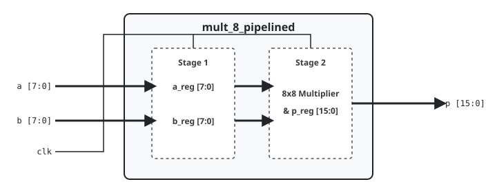

.. _datasheet_mult_8_pipelined:

8-bit Pipelined Multiplier
--------------------------

Introduction
~~~~~~~~~~~~

This benchmark is designed to test the DSP blocks, embedded multiplier slices, and register pipelining inside FPGAs.
The code performs 8-bit unsigned multiplication using two pipeline stages. In the first stage, the input operands (`a` and `b`) are sampled into input registers on the rising edge of the clock. In the second stage, the product is calculated and registered to the 16-bit output bus (`p`).

Source codes
~~~~~~~~~~~~

See details in ``mult/mult_8_pipelined``

Block Diagram
~~~~~~~~~~~~~

  8-bit Pipelined Multiplier schematic

Performance
~~~~~~~~~~~

Expect to consume 1 DSP block (or equivalent LUT multiplier logic) and 32 flip-flops of an FPGA.

.. warning:: The following resource utilization is just an estimation! Different tools in different versions may result differently.

.. list-table:: Estimated Resource Utilization
  :header-rows: 1
  :class: longtable

  * - Tool/Resource
    - Inputs
    - Outputs
    - LUT5
    - FF
    - Carry
    - DSP
    - BRAM
  * - General
    - 16
    - 16
    - 40
    - 32
    - 0
    - 1
    - 0
