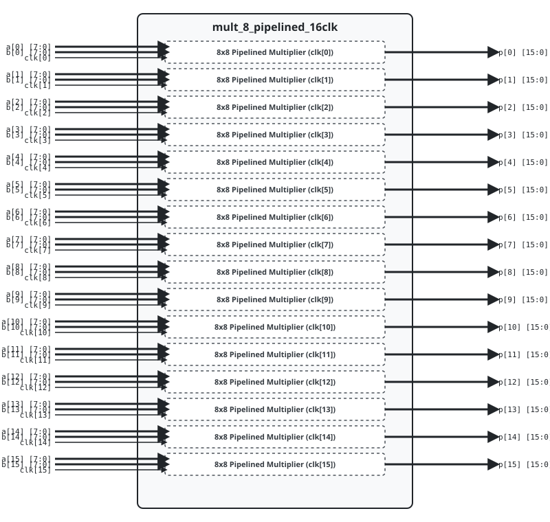

.. _datasheet_mult_8_pipelined_16clk:

8-bit Pipelined Multiplier 16 Clock
------------------------------------------

Introduction
~~~~~~~~~~~~

This benchmark tests DSP blocks, multiplier logic, and clock domain routing across **16 independent clock domains** in FPGAs.
The design instantiates 16 parallel 8-bit pipelined multipliers with registered input operands and registered output products.

Source codes
~~~~~~~~~~~~

See details in ``mult/mult_8_pipelined_16clk``

Block Diagram
~~~~~~~~~~~~~

  8-bit Pipelined Multiplier 16 Clock schematic

Performance
~~~~~~~~~~~

Expect to consume 16 DSP blocks (or equivalent LUT multiplier logic) and 512 flip-flops.

.. list-table:: Estimated Resource Utilization
  :header-rows: 1
  :class: longtable

  * - Benchmark
    - Inputs
    - Outputs
    - LUT5
    - FF
    - Carry
    - DSP
    - BRAM
  * - 16-Clock
    - 272
    - 256
    - 640
    - 512
    - 0
    - 16
    - 0
