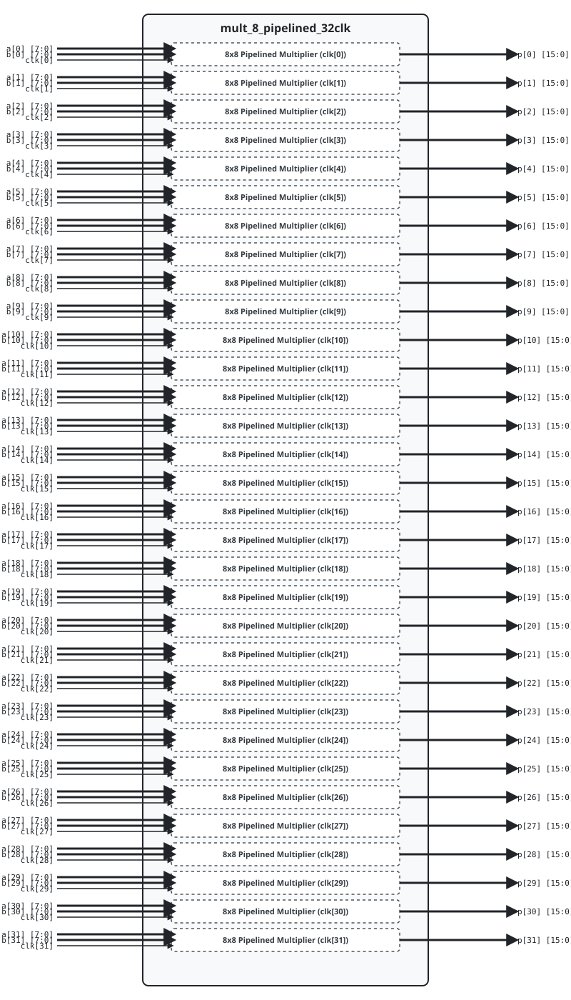

.. _datasheet_mult_8_pipelined_32clk:

8-bit Pipelined Multiplier 32 Clock
------------------------------------------

Introduction
~~~~~~~~~~~~

This benchmark tests DSP blocks, multiplier logic, and clock domain routing across **32 independent clock domains** in FPGAs.
The design instantiates 32 parallel 8-bit pipelined multipliers with registered input operands and registered output products.

Source codes
~~~~~~~~~~~~

See details in ``mult/mult_8_pipelined_32clk``

Block Diagram
~~~~~~~~~~~~~

  8-bit Pipelined Multiplier 32 Clock schematic

Performance
~~~~~~~~~~~

Expect to consume 32 DSP blocks (or equivalent LUT multiplier logic) and 1024 flip-flops.

.. list-table:: Estimated Resource Utilization
  :header-rows: 1
  :class: longtable

  * - Benchmark
    - Inputs
    - Outputs
    - LUT5
    - FF
    - Carry
    - DSP
    - BRAM
  * - 32-Clock
    - 544
    - 512
    - 1280
    - 1024
    - 0
    - 32
    - 0
