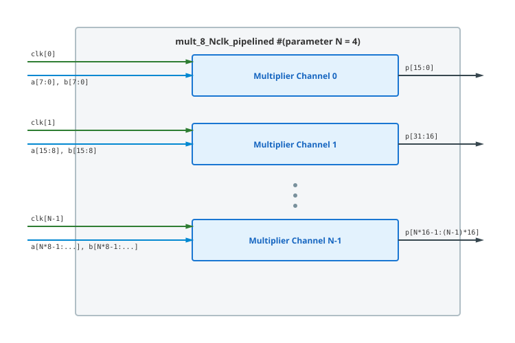

.. _datasheet_mult_8_pipelined_4clk:

8-bit Pipelined Multiplier 4 Clock
------------------------------------------

Introduction
~~~~~~~~~~~~

This benchmark tests DSP blocks, multiplier logic, and clock domain routing across **4 independent clock domains** in FPGAs.
The design instantiates 4 parallel 8-bit pipelined multipliers with registered input operands and registered output products.

Source codes
~~~~~~~~~~~~

See details in ``mult/mult_8_pipelined_4clk``

Block Diagram
~~~~~~~~~~~~~

This design is a 4-clock version of the illustrative schematic in :numref:`fig_mult_8_pipelined_4clk`

.. _fig_mult_8_pipelined_4clk:

  8-bit Pipelined Multiplier 4 Clock schematic

Performance
~~~~~~~~~~~

Expect to consume 4 DSP blocks (or equivalent LUT multiplier logic) and 128 flip-flops.

.. list-table:: Estimated Resource Utilization
  :header-rows: 1
  :class: longtable

  * - Benchmark
    - Inputs
    - Outputs
    - LUT5
    - FF
    - Carry
    - DSP
    - BRAM
  * - 4-Clock
    - 68
    - 64
    - 160
    - 128
    - 0
    - 4
    - 0
