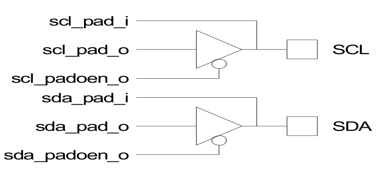
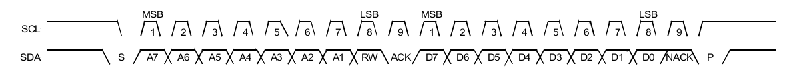
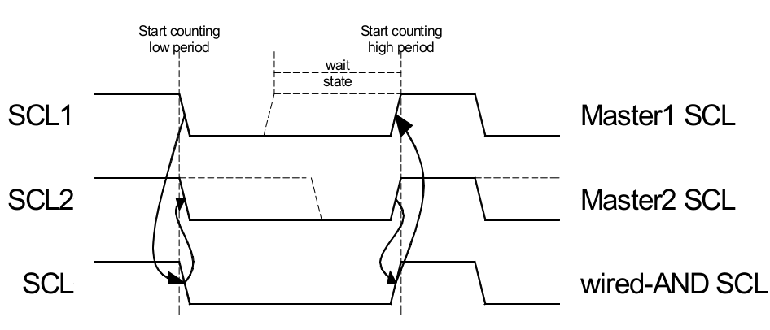
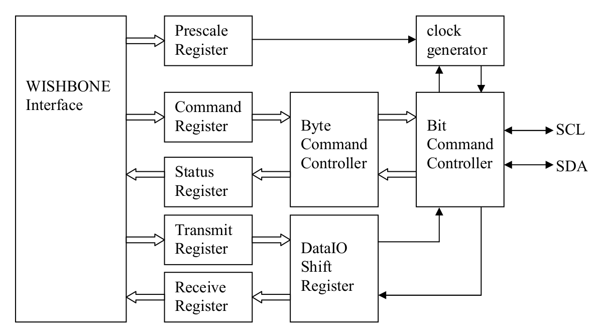
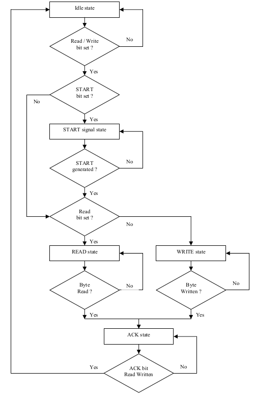
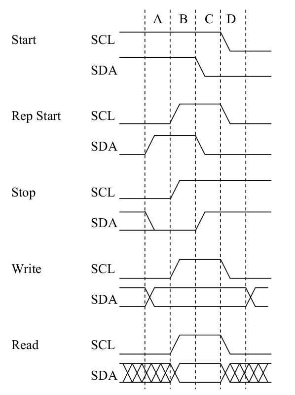
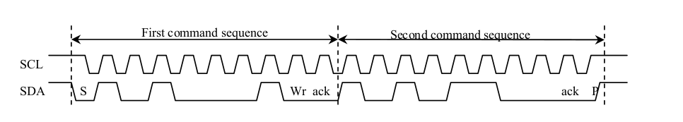

.. _datasheet_interface_opencores_i2c:

I2C-Master Core
===============

Author
------

Richard Herveille

*rherveille@opencores.org*

**Rev. 0.9**

**October 24, 2024**

Revision History
----------------

.. table:: Revision history

  +----+--------+---------------+----------------------------------------+
  | Re | Date   | Author        | Description                            |
  | v. |        |               |                                        |
  +----+--------+---------------+----------------------------------------+
  | 0  | 17     | Richard       | First draft release                    |
  | .1 | /02/01 | Herveille     |                                        |
  +----+--------+---------------+----------------------------------------+
  | 0  | 01     | Richard       | Some cleaning up throughout the        |
  | .2 | /03/01 | Herveille     | document                               |
  |    |        |               |                                        |
  |    |        |               | Added ‘Programming Examples’ section   |
  +----+--------+---------------+----------------------------------------+
  | 0  |        | Richard       | Added some comments after core-changes |
  | .3 |        | Herveille     |                                        |
  |    |        |               | -  added BUSY bit (status register)    |
  |    |        |               |                                        |
  |    |        |               | -  changed I2C IO for ASIC support     |
  |    |        |               |                                        |
  |    |        |               | -  added comment for FGPA IO           |
  +----+--------+---------------+----------------------------------------+
  | 0  | 10     | Richard       | Changed core’s databus size to 8bit.   |
  | .4 | /19/01 | Herveille     |                                        |
  |    |        |               | Changed documentation to reflect       |
  |    |        |               | changes.                               |
  |    |        |               |                                        |
  |    |        |               | Changed port names to new naming       |
  |    |        |               | convention.                            |
  +----+--------+---------------+----------------------------------------+
  | 0  | 18     | Richard       | Changed table headers.                 |
  | .5 | /02/02 | Herveille     |                                        |
  |    |        |               | Added OpenCores logo.                  |
  +----+--------+---------------+----------------------------------------+
  | 0. | 05     | Richard       | Reviewed entire document.              |
  | 5a | /02/02 | Herveille     |                                        |
  +----+--------+---------------+----------------------------------------+
  | 0  | 21     | Richard       | Added Appendix A, Synthesis Results    |
  | .6 | /03/02 | Herveille     |                                        |
  +----+--------+---------------+----------------------------------------+
  | 0  | 25     | Richard       | Changed Prescale Register formula      |
  | .7 | /06/02 | Herveille     |                                        |
  +----+--------+---------------+----------------------------------------+
  | 0  | 30     | Richard       | Added Multi-Master capabilities.       |
  | .8 | /12/02 | Herveille     |                                        |
  |    |        |               | New timing diagrams.                   |
  +----+--------+---------------+----------------------------------------+
  | 0  | 03     | Richard       | Changed ‘0x5C’ to ‘0xAC’ in Example1.  |
  | .9 | /07/03 | Herveille     |                                        |
  |    |        |               | Changed ‘RW’ to ‘W’ in Command         |
  |    |        |               | Register.                              |
  |    |        |               |                                        |
  |    |        |               | Changed ‘RW’ to ‘W’ in Transmit        |
  |    |        |               | Register.                              |
  +----+--------+---------------+----------------------------------------+

Introduction
------------

I2C is a two-wire, bi-directional serial bus that provides a
simple and efficient method of data exchange between devices. It is most
suitable for applications requiring occasional communication over a
short distance between many devices. The I2C standard is a
true multi-master bus including collision detection and arbitration that
prevents data corruption if two or more masters attempt to control the
bus simultaneously.

The interface defines 3 transmission speeds:

-  Normal: 100Kbps

-  Fast: 400Kbps

-  High speed: 3.5Mbps

Only 100Kbps and 400Kbps modes are supported directly. For High speed
special IOs are needed. If these IOs are available and used, then High
speed is also supported.

FEATURES
~~~~~~~~

-  **Compatible with Philips I\ 2\ C standard**

-  **Multi Master Operation**

-  **Software programmable clock frequency**

-  **Clock Stretching and Wait state generation**

-  **Software programmable acknowledge bit**

-  **Interrupt or bit-polling driven byte-by-byte data-transfers**

-  **Arbitration lost interrupt, with automatic transfer cancelation**

-  **Start/Stop/Repeated Start/Acknowledge generation**

-  **Start/Stop/Repeated Start detection**

-  **Bus busy detection**

-  **Supports 7 and 10bit addressing mode**

-  **Operates from a wide range of input clock frequencies**

-  **Static synchronous design**

-  **Fully synthesizable**

IO ports
--------

Core Parameters
~~~~~~~~~~~~~~~

.. table:: Core parameters

  +-----------+------+--------+-----------------------------------------+
  | Parameter | Type | Default| Description                             |
  +-----------+------+--------+-----------------------------------------+
  | ARST_LVL  | Bit  | 1’b0   | Asynchronous reset level                |
  +-----------+------+--------+-----------------------------------------+

ARST_LVL
^^^^^^^^

The asynchronous reset level can be set to either active high (1’b1) or
active low (1’b0).

WISHBONE interface signals
~~~~~~~~~~~~~~~~~~~~~~~~~~

.. table:: Wishbone interface signals

  +---------+------+---------+------------------------------------------+
  | Port    | Width|Direction|Description                               |
  +---------+------+---------+------------------------------------------+
  | wb_clk_i| 1    | Input   | Master clock                             |
  +---------+------+---------+------------------------------------------+
  | wb_rst_i| 1    | Input   | Synchronous reset, active high           |
  +---------+------+---------+------------------------------------------+
  | arst_i  | 1    | Input   | Asynchronous reset                       |
  +---------+------+---------+------------------------------------------+
  | wb_adr_i| 3    | Input   | Lower address bits                       |
  +---------+------+---------+------------------------------------------+
  | wb_dat_i| 8    | Input   | Data towards the core                    |
  +---------+------+---------+------------------------------------------+
  | wb_dat_o| 8    | Output  | Data from the core                       |
  +---------+------+---------+------------------------------------------+
  | wb_we_i | 1    | Input   | Write enable input                       |
  +---------+------+---------+------------------------------------------+
  | wb_stb_i| 1    | Input   | Strobe signal/Core select input          |
  +---------+------+---------+------------------------------------------+
  | wb_cyc_i| 1    | Input   | Valid bus cycle input                    |
  +---------+------+---------+------------------------------------------+
  | wb_ack_o| 1    | Output  | Bus cycle acknowledge output             |
  +---------+------+---------+------------------------------------------+
  | wb_inta_o| 1    | Output  | Interrupt signal output                  |
  +---------+------+---------+------------------------------------------+

The core features a WISHBONE RevB.3 compliant WISHBONE Classic
interface. All output signals are registered. Each access takes 2 clock
cycles.

arst_i is not a WISHBONE compatible signal. It is provided for FPGA
implementations. Using [arst_i] instead of [wb_rst_i] can result in
lower cell-usage and higher performance, because most FPGAs provide a
dedicated asynchronous reset path. Use either [arst_i] or [wb_rst_i],
tie the other to a negated state.

External connections
~~~~~~~~~~~~~~~~~~~~

.. table:: External connections

  +-----------+------+---------+----------------------------------------+
  | Port      | Width|Direction|Description                             |
  +-----------+------+---------+----------------------------------------+
  | scl_pad_i | 1    | Input   | Serial Clock line input                |
  +-----------+------+---------+----------------------------------------+
  | scl_pad_o | 1    | Output  | Serial Clock line output               |
  +-----------+------+---------+----------------------------------------+
  | scl_pad_oe| 1    | Output  | Serial Clock line output enable        |
  +-----------+------+---------+----------------------------------------+
  | sda_pad_i | 1    | Input   | Serial Data line input                 |
  +-----------+------+---------+----------------------------------------+
  | sda_pad_o | 1    | Output  | Serial Data line output                |
  +-----------+------+---------+----------------------------------------+
  | sda_pad_oe| 1    | Output  | Serial Data line output enable         |
  +-----------+------+---------+----------------------------------------+
  
The IC interface uses a serial data line (SDA) and a serial
clock line (SCL) for data transfers. All devices connected to these two
signals must have open drain or open collector outputs. Both lines must
be pulled-up to VCC by external resistors.

The tri-state buffers for the SCL and SDA lines must be added at a
higher hierarchical level. Connections should be made according to the
figure:

.. _fig_opencores_i2c_tribuf_io:

  Tri-state buffer connection

For FPGA designs the compiler can automatically insert these buffers
using the following VHDL code:

.. code-block:: 

  scl <= scl_pad_o when (scl_padoen_oe = ‘0’) else ‘Z’;
  sda <= sda_pad_o when (sda_padoen_oe = ‘0’) else ‘Z’;
  scl_pad_i <= scl;
  scl_pad_i <= sda;

Verilog code:

.. code-block:: 

  assign scl = scl_padoen_oe ? 1’bz : scl_pad_o;
  assign sda = sda_padoen_oe ? 1’bz: sda_pad_o;
  assign scl_pad_i = scl;
  assign sda_pad_i = sda;

Registers
---------

Registers list
~~~~~~~~~~~~~~

.. table:: Register list

  +-------+---------+-------+-------+-----------------------------------+
  | Name  | Address | Width | Access|Description                        |
  +-------+---------+-------+-------+-----------------------------------+
  | PRERlo| 0x00    | 8     | RW    | Clock Prescale register lo-byte   |
  +-------+---------+-------+-------+-----------------------------------+
  | PRERhi| 0x01    | 8     | RW    | Clock Prescale register hi-byte   |
  +-------+---------+-------+-------+-----------------------------------+
  | CTR   | 0x02    | 8     | RW    | Control register                  |
  +-------+---------+-------+-------+-----------------------------------+
  | TXR   | 0x03    | 8     | W     | Transmit register                 |
  +-------+---------+-------+-------+-----------------------------------+
  | RXR   | 0x03    | 8     | R     | Receive register                  |
  +-------+---------+-------+-------+-----------------------------------+
  | CR    | 0x04    | 8     | W     | Command register                  |
  +-------+---------+-------+-------+-----------------------------------+
  | SR    | 0x04    | 8     | R     | Status register                   |
  +-------+---------+-------+-------+-----------------------------------+

Register description
~~~~~~~~~~~~~~~~~~~~

Prescale Register
^^^^^^^^^^^^^^^^^

This register is used to prescale the SCL clock line. Due to the
structure of the I2C interface, the core uses a 5*SCL clock
internally. The prescale register must be programmed to this 5*SCL
frequency (minus 1). Change the value of the prescale register only when
the ‘EN’ bit is cleared.

Example: wb_clk_i = 32MHz, desired SCL = 100KHz

prescale = 32 MHz / (5*100 KHz) - 1 = 63 (dec) = 3F (hex)

Reset value: 0xFFFF

Control register
^^^^^^^^^^^^^^^^

+-----+------+--------------------------------------------------------+
| Bit#|Access|Description                                             |
+-----+------+--------------------------------------------------------+
| 7   | RW   | EN, I\ :sup:`2`\ C core enable bit.                    |
|     |      |                                                        |
|     |      | When set to ‘1’, the core is enabled.                  |
|     |      |                                                        |
|     |      | When set to ‘0’, the core is disabled.                 |
+-----+------+--------------------------------------------------------+
| 6   | RW   | IEN, I\ :sup:`2`\ C core interrupt enable bit.         |
|     |      |                                                        |
|     |      | When set to ‘1’, interrupt is enabled.                 |
|     |      |                                                        |
|     |      | When set to ‘0’, interrupt is disabled.                |
+-----+------+--------------------------------------------------------+
| 5:0 | RW   | Reserved                                   |
+-----+------+--------------------------------------------------------+

Reset Value: 0x00

The core responds to new commands only when the ‘EN’ bit is set. Pending
commands are finished. Clear the ‘EN’ bit only when no transfer is in
progress, i.e. after a STOP command, or when the command register has
the STO bit set. When halted during a transfer, the core can hang the
I\ :sup:`2`\ C bus.

Transmit register
^^^^^^^^^^^^^^^^^

+-----+------+--------------------------------------------------------+
| Bit#|Access|Description                                             |
+-----+------+--------------------------------------------------------+
| 7:1 | W    | Next byte to transmit via I\ :sup:`2`\ C               |
+-----+------+--------------------------------------------------------+
| 0   | W    | In case of a data transfer this bit represent the      |
|     |      | data’s LSB.                                            |
|     |      |                                                        |
|     |      | In case of a slave address transfer this bit           |
|     |      | represents the RW bit.                                 |
|     |      |                                                        |
|     |      | ‘1’ = reading from slave                               |
|     |      |                                                        |
|     |      | ‘0’ = writing to slave                                 |
+-----+------+--------------------------------------------------------+

Reset value: 0x00

Receive register
^^^^^^^^^^^^^^^^

+-----+------+--------------------------------------------------------+
| Bit#|Access|Description                                             |
+-----+------+--------------------------------------------------------+
| 7:0 | R    | Last byte received via I\ :sup:`2`\ C                  |
+-----+------+--------------------------------------------------------+

Reset value: 0x00

Command register
^^^^^^^^^^^^^^^^

+-----+------+--------------------------------------------------------+
| Bit#|Access|Description                                             |
+-----+------+--------------------------------------------------------+
| 7   | W    | STA, generate (repeated) start condition               |
+-----+------+--------------------------------------------------------+
| 6   | W    | STO, generate stop condition                           |
+-----+------+--------------------------------------------------------+
| 5   | W    | RD, read from slave                                    |
+-----+------+--------------------------------------------------------+
| 4   | W    | WR, write to slave                                     |
+-----+------+--------------------------------------------------------+
| 3   | W    | ACK, when a receiver, sent ACK (ACK = ‘0’) or NACK     |
|     |      | (ACK = ‘1’)                                            |
+-----+------+--------------------------------------------------------+
| 2:1 | W    | Reserved                                   |
+-----+------+--------------------------------------------------------+
| 0   | W    | IACK, Interrupt acknowledge. When set,     |
|     |      |    clears a pending interrupt.                         |
+-----+------+--------------------------------------------------------+

Reset Value: 0x00

The STA, STO, RD, WR, and IACK bits are cleared automatically. These
bits are always read as zeros.

Status register
^^^^^^^^^^^^^^^

+-----+------+--------------------------------------------------------+
| Bit#|Access|Description                                             |
+-----+------+--------------------------------------------------------+
| 7   | R    | RxACK, Received acknowledge from slave.                |
|     |      |                                                        |
|     |      | This flag represents acknowledge from the addressed    |
|     |      | slave.                                                 |
|     |      |                                                        |
|     |      | ‘1’ = No acknowledge received                          |
|     |      |                                                        |
|     |      | ‘0’ = Acknowledge received                             |
+-----+------+--------------------------------------------------------+
| 6   | R    | Busy, I\ :sup:`2`\ C bus busy              |
|     |      | ‘1’ after START signal detected                        |
|     |      |                                                        |
|     |      | ‘0’ after STOP signal detected                         |
+-----+------+--------------------------------------------------------+
| 5   | R    | AL, Arbitration lost                       |
|     |      |                                                        |
|     |      | This bit is set when the core lost arbitration.        |
|     |      | Arbitration is lost when:                              |
|     |      |                                                        |
|     |      | -  a STOP signal is detected, but non requested        |
|     |      |                                                        |
|     |      | -  The master drives SDA high, but SDA is low.         |
|     |      |                                                        |
|     |      | See *bus-arbitration* section for more information.    |
+-----+------+--------------------------------------------------------+
| 4:2 | R    | Reserved                                   |
+-----+------+--------------------------------------------------------+
| 1   | R    | TIP, Transfer in progress.                             |
|     |      |                                                        |
|     |      | ‘1’ when transferring data                             |
|     |      |                                                        |
|     |      | ‘0’ when transfer complete                             |
+-----+------+--------------------------------------------------------+
| 0   | R    | IF, Interrupt Flag. This bit is set when an interrupt  |
|     |      | is pending, which will cause a processor interrupt     |
|     |      | request if the IEN bit is set.                         |
|     |      |                                                        |
|     |      | The Interrupt Flag is set when:                        |
|     |      |                                                        |
|     |      | -  one byte transfer has been completed                |
|     |      |                                                        |
|     |      | -  arbitration is lost                                 |
+-----+------+--------------------------------------------------------+

Reset Value: 0x00

*Please note that all* **reserved bits** *are read as zeros. To ensure
forward compatibility, they should be written as zeros.*

Operation
---------

System Configuration
~~~~~~~~~~~~~~~~~~~~

The I\ :sup:`2`\ C system uses a serial data line (SDA) and a serial
clock line (SCL) for data transfers. All devices connected to these two
signals must have open drain or open collector outputs. The logic AND
function is exercised on both lines with external pull-up resistors.

Data is transferred between a Master and a Slave synchronously to SCL on
the SDA line on a byte-by-byte basis. Each data byte is 8 bits long.
There is one SCL clock pulse for each data bit with the MSB being
transmitted first. An acknowledge bit follows each transferred byte.
Each bit is sampled during the high period of SCL; therefore, the SDA
line may be changed only during the low period of SCL and must be held
stable during the high period of SCL. A transition on the SDA line while
SCL is high is interpreted as a command (see START and STOP signals).

I\ :sup:`2`\ C Protocol
~~~~~~~~~~~~~~~~~~~~~~~

Normally, a standard communication consists of four parts:

1) START signal generation

2) Slave address transfer

3) Data transfer

4) STOP signal generation

.. _fig_opencores_i2c_waveform:

  I2C waveform

START signal
^^^^^^^^^^^^

When the bus is free/idle, meaning no master device is engaging the bus
(both SCL and SDA lines are high), a master can initiate a transfer by
sending a START signal. A START signal, usually referred to as the
S-bit, is defined as a high-to-low transition of SDA while SCL is high.
The START signal denotes the beginning of a new data transfer.

A Repeated START is a START signal without first generating a STOP
signal. The master uses this method to communicate with another slave or
the same slave in a different transfer direction (e.g. from writing to a
device to reading from a device) without releasing the bus.

The core generates a START signal when the STA-bit in the Command
Register is set and the RD or WR bits are set. Depending on the current
status of the SCL line, a START or Repeated START is generated.

Slave Address Transfer
^^^^^^^^^^^^^^^^^^^^^^

The first byte of data transferred by the master immediately after the
START signal is the slave address. This is a seven-bits calling address
followed by a RW bit. The RW bit signals the slave the data transfer
direction. No two slaves in the system can have the same address. Only
the slave with an address that matches the one transmitted by the master
will respond by returning an acknowledge bit by pulling the SDA low at
the 9th SCL clock cycle.

Note: The core supports 10bit slave addresses by generating two address
transfers. See the Philips I\ :sup:`2`\ C specifications for more
details.

The core treats a Slave Address Transfer as any other write action.
Store the slave device’s address in the Transmit Register and set the WR
bit. The core will then transfer the slave address on the bus.

Data Transfer
^^^^^^^^^^^^^

Once successful slave addressing has been achieved, the data transfer
can proceed on a byte-by-byte basis in the direction specified by the RW
bit sent by the master. Each transferred byte is followed by an
acknowledge bit on the 9th SCL clock cycle. If the slave signals a No
Acknowledge, the master can generate a STOP signal to abort the data
transfer or generate a Repeated START signal and start a new transfer
cycle.

If the master, as the receiving device, does not acknowledge the slave,
the slave releases the SDA line for the master to generate a STOP or
Repeated START signal.

To write data to a slave, store the data to be transmitted in the
Transmit Register and set the WR bit. To read data from a slave, set the
RD bit. During a transfer the core set the TIP flag, indicating that a
Transfer is In Progress. When the transfer is done the TIP flag is
reset, the IF flag set and, when enabled, an interrupt generated. The
Receive Register contains valid data after the IF flag has been set. The
user may issue a new write or read command when the TIP flag is reset.

STOP signal
^^^^^^^^^^^

The master can terminate the communication by generating a STOP signal.
A STOP signal, usually referred to as the P-bit, is defined as a
low-to-high transition of SDA while SCL is at logical ‘1’.

Arbitration Procedure
~~~~~~~~~~~~~~~~~~~~~

Clock Synchronization
^^^^^^^^^^^^^^^^^^^^^

The I\ :sup:`2`\ C bus is a true multimaster bus that allows more than
one master to be connected on it. If two or more masters simultaneously
try to control the bus, a clock synchronization procedure determines the
bus clock. Because of the wired-AND connection of the I\ :sup:`2`\ C
signals a high to low transition affects all devices connected to the
bus. Therefore a high to low transition on the SCL line causes all
concerned devices to count off their low period. Once a device clock has
gone low it will hold the SCL line in that state until the clock high
state is reached. Due to the wired-AND connection the SCL line will
therefore be held low by the device with the longest low period, and
held high by the device with the shortest high period.

.. _fig_opencores_i2c_clk_sync:

  Clock synchronization

Clock Stretching
^^^^^^^^^^^^^^^^

Slave devices can use the clock synchronization mechanism to slow down
the transfer bit rate. After the master has driven SCL low, the slave
can drive SCL low for the required period and then release it. If the
slave’s SCL low period is greater than the master’s SCL low period, the
resulting SCL bus signal low period is stretched, thus inserting
wait-states.

Architecture
------------

The I2C core is built around four primary blocks; the Clock Generator,
the Byte Command Controller, the Bit Command Controller and the DataIO
Shift Register.

All other blocks are used for interfacing or for storing temporary
values.

.. _fig_opencores_i2c_internal_structure:

  Internal structure of I2C master core

Clock Generator
~~~~~~~~~~~~~~~

The Clock Generator generates an internal 4*Fscl clock enable signal
that triggers all synchronous elements in the Bit Command Controller. It
also handles clock stretching needed by some slaves.

Byte Command Controller
~~~~~~~~~~~~~~~~~~~~~~~

The Byte Command Controller handles I2C traffic at the byte level. It
takes data from the Command Register and translates it into sequences
based on the transmission of a single byte. By setting the START, STOP,
and READ bit in the Command Register, for example, the Byte Command
Controller generates a sequence that results in the generation of a
START signal, the reading of a byte from the slave device, and the
generation of a STOP signal. It does this by dividing each byte
operation into separate bit-operations, which are then sent to the Bit
Command Controller.

.. _fig_opencores_i2c_bit_cmd_ctrl_flowchart:

  Bit command controller flow chart

Bit Command Controller
~~~~~~~~~~~~~~~~~~~~~~

The Bit Command Controller handles the actual transmission of data and
the generation of the specific levels for START, Repeated START, and
STOP signals by controlling the SCL and SDA lines. The Byte Command
Controller tells the Bit Command Controller which operation has to be
performed. For a single byte read, the Bit Command Controller receives 8
separate read commands. Each bit-operation is divided into 5 pieces
(idle and A, B, C, and D), except for a STOP operation which is divided
into 4 pieces (idle and A, B, and C).

.. _fig_opencores_i2c_bit_cmd_ctrl_waveform:

  Bit command controller waveform

DataIO Shift Register
~~~~~~~~~~~~~~~~~~~~~

The DataIO Shift Register contains the data associated with the current
transfer. During a read action, data is shifted in from the SDA line.
After a byte has been read the contents are copied into the Receive
Register. During a write action, the Transmit Register’s contents are
copied into the DataIO Shift Register and are then transmitted onto the
SDA line.

Programming examples
--------------------

Example 1
~~~~~~~~~

Write 1 byte of data to a slave.

Slave address = 0x51 (b”1010001”)

Data to write = 0xAC

I2C Sequence:

1) generate start command

2) write slave address + write bit

3) receive acknowledge from slave

4) write data

5) receive acknowledge from slave

6) generate stop command

Commands:

1) write 0xA2 (address + write bit) to Transmit Register, set STA bit,
   set WR bit.

-- wait for interrupt or TIP flag to negate --

2) read RxACK bit from Status Register, should be ‘0’.

write 0xAC to Transmit register, set STO bit, set WR bit.

-- wait for interrupt or TIP flag to negate --

3) read RxACK bit from Status Register, should be ‘0’.

.. _fig_opencores_i2c_prog_example_waveform1:

  Waveform of program example 1

.. note:: Please note that the time for the Interrupt Service Routine is not shown here. It is assumed that the ISR is much faster then the I2C cycle time, and therefore not visible.

Example 2
~~~~~~~~~

Read a byte of data from an I2C memory device.

Slave address = 0x4E

Memory location to read from = 0x20

I2C sequence:

1)  generate start signal

2)  write slave address + write bit

3)  receive acknowledge from slave

4)  write memory location

5)  receive acknowledge from slave

6)  generate repeated start signal

7)  write slave address + read bit

8)  receive acknowledge from slave

9)  read byte from slave

10) write no acknowledge (NACK) to slave, indicating end of transfer

11) generate stop signal

Commands:

1) write 0x9C (address + write bit) to Transmit Register, set STA bit,
   set WR bit.

-- wait for interrupt or TIP flag to negate --

2) read RxACK bit from Status Register, should be ‘0’.

write 0x20 to Transmit register, set WR bit.

-- wait for interrupt or TIP flag to negate --

3) read RxACK bit from Status Register, should be ‘0’.

..

   write 0x9D (address + read bit) to Transmit Register, set STA bit,
   set WR bit.

-- wait for interrupt or TIP flag to negate --

4) set RD bit, set ACK to ‘1’ (NACK), set STO bit

.. _fig_opencores_i2c_prog_example_waveform2:

.. figure:: ./figures/opencores_i2c/prog_example_waveform2.png
  :width: 100%
  :alt: Program example 2 

  Waveform of program example 2

.. note:: Please note that the time for the Interrupt Service Routine is not shown here. It is assumed that the ISR is much faster then the I2C cycle time, and therefore not visible.

Appendix A
----------

Synthesis results
~~~~~~~~~~~~~~~~~

Synthesis tool: Synplify Pro

.. table:: Synthesis result using Synoplify Pro

  +------------+-----------------+-------+---------+-------------------+
  | Technology | Device          | Speed | Fmax    | Resource usage    |
  |            |                 | grade |         |                   |
  +------------+-----------------+-------+---------+-------------------+
  | ACTEL      | A54SX16ATQ100   | std   | 58MHz   | Modules: 352      |
  +------------+-----------------+-------+---------+-------------------+
  | Altera     | EP10K50ETC144   | -3    | 82MHz   | LCs: 294          |
  +------------+-----------------+-------+---------+-------------------+
  |            | EP20K30ETC144   | -3    | 74MHz   | ATOMS: 257        |
  +------------+-----------------+-------+---------+-------------------+
  | Xilinx     | 2s15CS144       | -5    | 82MHz   | LUTs: 229         |
  +------------+-----------------+-------+---------+-------------------+
  |            | XCV50ECS144     | -8    | 118MHz  | LUTs: 230         |
  +------------+-----------------+-------+---------+-------------------+
