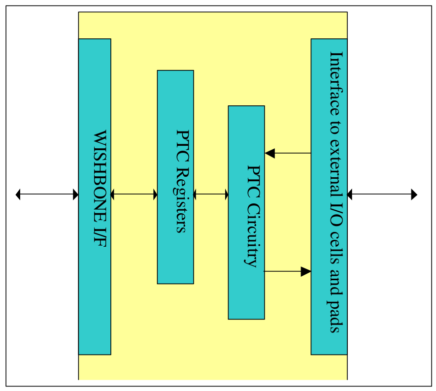
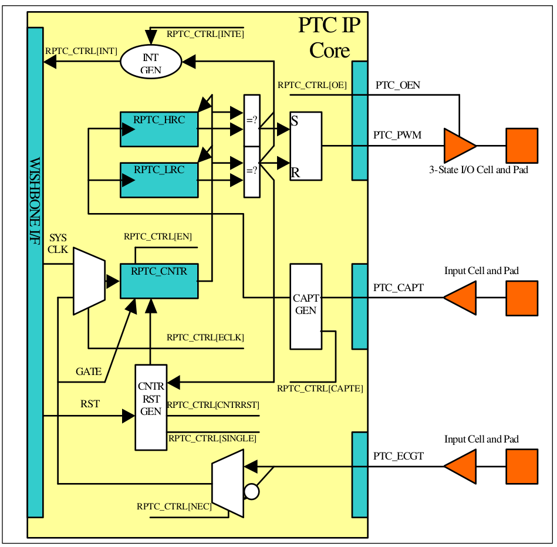
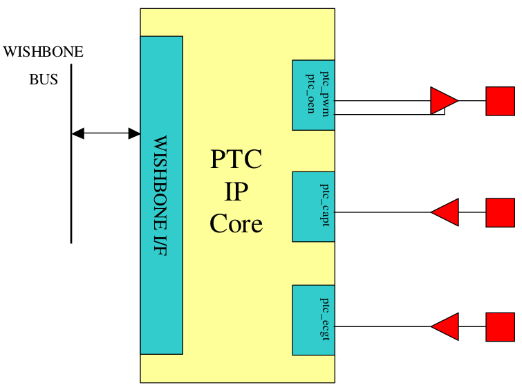

.. _datasheet_interface_opencores_ptc:

PWM/Timer/Counter IP Core
=========================

Specification

Authors
-------

Damjan Lampret

*lampret@opencores.org*

**Rev. 0.1**

**February 28, 2001**

**Preliminary Draft**

Revision History
----------------

.. table:: Revision history

   +-----+---------+------------------+----------------------------------+
   | R   | Date    | Author           | Description                      |
   | ev. |         |                  |                                  |
   +-----+---------+------------------+----------------------------------+
   | 0.1 | 28/2/01 | Damjan Lampret   | First Draft                      |
   +-----+---------+------------------+----------------------------------+
   |     |         |                  |                                  |
   +-----+---------+------------------+----------------------------------+
   |     |         |                  |                                  |
   +-----+---------+------------------+----------------------------------+

Introduction
------------

The PWM/Timer/Counter (PTC) IP core is a user-programmable PWM, Timer
and Counter controller. Its use is to implement functions like Pulse
Width Modulation (PWM), timer and counter facilities.

Features
~~~~~~~~

The following lists the main features of PTC IP core:

-  32-bit counter/timer facility

-  single-run or continues run of PTC counter

-  Programmable PWM mode

-  System clock and external clock sources for timer functionality

-  HI/LO Reference and Capture registers

-  Three-state control for PWM output driver

-  PWM/Timer/Counter functionalities can cause an interrupt to the CPU

-  WISHBONE SoC Interconnection Rev. B compliant interface

Architecture
------------

:numref:`fig_opencores_ptc_core_arch` below shows general architecture of PTC IP core. It consists of
four main building blocks:

-  WISHBONE host interface

-  PTC registers

-  PTC circuitry

-  Interface to external I/O cells and pads

.. _fig_opencores_ptc_core_arch:

  Core Architecture

Clocks
~~~~~~

The PTC core has two clock domains. All registers except RPTC_CNTR are
in system clock domain.

RPTC_CNTR register can be clocked by either system clock or by external
clock reference.

WISHBONE Interface
~~~~~~~~~~~~~~~~~~

WISHBONE slave interface connects PTC core to the host system. It is
WISHBONE SoC Interconnection specification Rev. B compliant. The
implementation implements a 32-bit bus width and does not support other
bus widths.

.. figure:: figures/wbcompatible.png
   :width: 100%

PTC Registers
~~~~~~~~~~~~~

The PTC IP Core has several software accessible registers. The host
through these registers programs type and operation of the PTC core.

PTC Circuitry
~~~~~~~~~~~~~

The PTC core circuitry consists of clock dividers and reference
comparators for PWM and counter/timer. It also includes an interrupt
generator.

Interface to External I/O Cells and Pads
~~~~~~~~~~~~~~~~~~~~~~~~~~~~~~~~~~~~~~~~

External interface connects PTC core to external I/O ring cells and
pads. External interface is made of eclk/gate input, capture input, PWM
output and PWM output driver enable. PWM output can be three-stated with
the provided enable signal for the output driver.

Operation
---------

This section describes the operation of the PTC core. The PTC core
provides PWM, timer and counter facilities. Selection between modes is
done implicitly with configuration of the control bits.

.. _fig_opencores_ptc_block_diagram:

  Block Diagram of PTC Logic

When operating in PWM mode, the PTC core generates binary signal with
user-programmable low and high periods. Clock source for the PWM can be
either system clock or external clock on ptc_ecgt pin. Input signal
ptc_capt can be used to capture value of the RPTC_CNTR register into low
and high capture registers.

When operating from system clock, ptc_ecgt can be used to gate internal
PWM counter circuitry.

When operating in timer/counter mode, the PTC core counts number of
clock cycles of system clock or external clock reference on ptc_ecgt
pin. After reaching low and/or high reference, the PTC core can generate
an interrupt. Input signal ptc_capt can be used to capture value of the
RPTC_CNTR register into low and high capture registers.

When operating from the system clock, ptc_ecgt can be used to gate
internal timer/counter circuitry.

In both PWM and timer/counter modes, RPTC_CNTR can run for a single
cycle and it can automatically restart after each complete cycle. Cycle
completes after reaching value in the RPTC_LRC register. These two modes
are called single-run and continues run.

Hardware Reset
~~~~~~~~~~~~~~

Following hardware reset PWM output driver is disabled. Interrupt
request signal is masked. Ptc_ecgt signal is not used for incrementing
the RPTC_CNTR register; instead system clock is used.

PWM Mode
~~~~~~~~

To operate in PWM mode, RPTC_HRC and RPTC_LRC should be set with the
value of low and high periods of the PWM output signal. RPTC_HRC is
number of clock cycles after reset of the RPTC_CNTR when PWM output
should go high. And RPTC_LRC is number of clock cycles after reset of
the RPTC_CNTR when PWM output should go low. RPTC_CNTR can be reset with
the hardware reset, bit RPTC_CTRL[CNTRRST] or periodically when
RPTC_CTRL[SINGLE] bit is cleared.

To enable PWM output driver, RPTC_CTRL[OE] should be set.

To enable continues operation, RPTC_CTRL[SINGLE] should be cleared and
RPTC_CTRL[EN] should be set.

If gate function is enabled, PWM periods can be automatically adjusted
with the capture input. PWM output signal is controlled with the
RPTC_HRC and RPTC_LRC, and these two registers can be set without
software control with the ptc_capt signal.

Timer/Counter Mode
~~~~~~~~~~~~~~~~~~

To operate in timer/counter mode, only RPTC_LRC or even neither of
capture/reference registers is required. In this mode system clock or
external clock reference increments RPTC_CNTR register. When RPTC_CNTR
equals to the RPTC_LRC, RPTC_CNTR can be reset if this is selected with
the RPTC_CTRL[SINGLE].

Usually interrupts are enabled in timer/counter mode. This is done with
the RPTC_CTRL[INTE].

Gate Feature
~~~~~~~~~~~~

If system clock is used to increment RPTC_CNTR, ptc_ecgt input signal
can be used to gate the system clock and not increment the RPTC_CNTR
register. Which level of the ptc_ecgt has gating capability depends on
value of the RPTC_CTRL[NEC].

Interrupt Feature
~~~~~~~~~~~~~~~~~

Whenever RPTC_CNTR equals to the value of the RPTC_HRC or RPTC_LRC, an
interrupt request can be asserted. This depends if RPTC_CTRL[INTE] bit
is set.

Capture Feature
~~~~~~~~~~~~~~~

Input signal ptc_capt can be used to capture value of the current
RPTC_CNTR into RPTC_HRC or LPTC_LRC registers. Into which
reference/capture register value is captured, depends on edge of the
ptc_capt signal. On positive edge value is captured into RPTC_HRC
register and on negative edge value is captured into RPTC_LRC register.

In order to enable capture feature, RPTC_CTRL[CAPTE] must be set.

Registers
---------

This section describes all control and status register inside the PTC
core. The *Address* field indicates address in hexadecimal. *Width*
specifies the number of bits in the register, and *Access* specifies the
valid access types for that register. R/W stands for read and write
access and R stands for read only access.

Registers list
~~~~~~~~~~~~~~

.. table:: Main PTC Counter

   +------------+----------+-----+-----+---------------------------------+
   | Name       | Address  | Wi  | Acc | Description                     |
   |            |          | dth | ess |                                 |
   +------------+----------+-----+-----+---------------------------------+
   | RPTC_CNTR  | Base +   | 32  | R/W | Main PTC counter                |
   |            | 0x0      |     |     |                                 |
   +------------+----------+-----+-----+---------------------------------+
   | RPTC_HRC   | Base +   | 32  | R/W | PTC HI Reference/Capture        |
   |            | 0x4      |     |     | register                        |
   +------------+----------+-----+-----+---------------------------------+
   | RPTC_LRC   | Base +   | 32  | R/W | PTC LO Reference/Capture        |
   |            | 0x8      |     |     | register                        |
   +------------+----------+-----+-----+---------------------------------+
   | RPTC_CTRL  | Base +   | 9   | R/W | Control register                |
   |            | 0xC      |     |     |                                 |
   +------------+----------+-----+-----+---------------------------------+

Register RPTC_CNTR description
~~~~~~~~~~~~~~~~~~~~~~~~~~~~~~

RPTC_CNTR register is the actual counter register. It is incremented at
every counter/timer clock cycle. Source clock is either system clock or
ptc_ecgt eclk/gate input. Selection between both clocks is performed
with the RPTC_CTRL[ECLK]. Active edge of external clock is selected with
the RPTC_CTRL[NEC].

In order to count, RPTC_CNTR must first be enabled with the
RPTC_CTRL[EN].

RPTC_CNTR can be reset with the RPTC_CTRL[RST].

RPTC_CNTR can operate in either single-run mode or continues mode. Mode
is selected with the RPTC_CTRL[SINGLE].

.. table:: RPTC_HRC Register

   +------+-------+--------+---------------------------------------------+
   | Bit  | A     | Reset  | Description                                 |
   | #    | ccess |        |                                             |
   +------+-------+--------+---------------------------------------------+
   | 32   | R/W   | 0x0    | Main PTC Counter                            |
   +------+-------+--------+---------------------------------------------+

Register RPTC_HRC description
~~~~~~~~~~~~~~~~~~~~~~~~~~~~~

RPTC_HRC register is a 2nd out of two reference/capture
registers. It has two functions:

-  In reference mode it is used to assert high PWM output or to generate
   an interrupt

-  In capture mode it captures RPTC_CNTR value on high value of ptc_capt
   signal

.. table:: RPTC_LRC Register

   +------+-------+--------+---------------------------------------------+
   | Bit  | A     | Reset  | Description                                 |
   | #    | ccess |        |                                             |
   +------+-------+--------+---------------------------------------------+
   | 32   | R/W   | 0x0    | HI Reference/Capture register               |
   +------+-------+--------+---------------------------------------------+

The RPTC_HRC should have lower value than RPTC_LRC. This is because PWM
output goes first high and later low.

Register RPTC_LRC description
~~~~~~~~~~~~~~~~~~~~~~~~~~~~~

RPTC_LRC register is a 1st out of two reference/capture
registers. It has two functions:

-  In reference mode it is used to assert low PWM output or to generate
   an interrupt

-  In capture mode it captures RPTC_CNTR value on low value of ptc_capt
   signal

.. table:: Control Register

   +------+-------+--------+---------------------------------------------+
   | Bit  | A     | Reset  | Description                                 |
   | #    | ccess |        |                                             |
   +------+-------+--------+---------------------------------------------+
   | 32   | R/W   | 0x0    | LO Reference/Capture register               |
   +------+-------+--------+---------------------------------------------+

The RPTC_LRC should have higher value than RPTC_HRC. This is because PWM
output goes first high and later low.

Register RPTC_CTRL description
~~~~~~~~~~~~~~~~~~~~~~~~~~~~~~

Control bits in RPTC_CTRL register control operation of PTC core.

.. table:: WISHBONE Interface Signals

   +------+-------+--------+---------------------------------------------+
   | Bit  | A     | Reset  | Description                                 |
   | #    | ccess |        |                                             |
   +------+-------+--------+---------------------------------------------+
   | 0    | R/W   | 0      | EN                                          |
   |      |       |        |                                             |
   |      |       |        | When set, RPTC_CNTR can be incremented.     |
   +------+-------+--------+---------------------------------------------+
   | 1    | R/W   | 0      | ECLK                                        |
   |      |       |        |                                             |
   |      |       |        | When set, ptc_ecgt signal is used to        |
   |      |       |        | increment RPTC_CNTR.                        |
   |      |       |        |                                             |
   |      |       |        | When cleared, system clock is used instead. |
   +------+-------+--------+---------------------------------------------+
   | 2    | R/W   | 0      | NEC                                         |
   |      |       |        |                                             |
   |      |       |        | When set, ptc_ecgt increments on negative   |
   |      |       |        | edge and gates on low period.               |
   |      |       |        |                                             |
   |      |       |        | When cleared, ptc_ecgt increments on        |
   |      |       |        | positive edge and gates on high period.     |
   |      |       |        |                                             |
   |      |       |        | This bit has effect only on ‘gating’        |
   |      |       |        | function of ptc_ecgt when RPTC_CTRL[ECLK]   |
   |      |       |        | bit is cleared.                             |
   +------+-------+--------+---------------------------------------------+
   | 3    | R/W   | 0      | OE                                          |
   |      |       |        |                                             |
   |      |       |        | Inverted value of this bit is reflected on  |
   |      |       |        | the ptc_oen signal. It is used to enable    |
   |      |       |        | PWM output driver.                          |
   +------+-------+--------+---------------------------------------------+
   | 4    | R/W   | 0      | SINGLE                                      |
   |      |       |        |                                             |
   |      |       |        | When set, RPTC_CNTR is not incremented      |
   |      |       |        | anymore after it reaches value equal to the |
   |      |       |        | RPTC_LRC value.                             |
   |      |       |        |                                             |
   |      |       |        | When cleared, RPTC_CNTR is restarted after  |
   |      |       |        | it reaches value in the RPTC_LCR register.  |
   +------+-------+--------+---------------------------------------------+
   | 5    | R/W   | 0      | INTE                                        |
   |      |       |        |                                             |
   |      |       |        | When set, PTC asserts an interrupt when     |
   |      |       |        | RPTC_CNTR value is equal to the value of    |
   |      |       |        | RPTC_LRC or RPTC_HRC.                       |
   |      |       |        |                                             |
   |      |       |        | When cleared, interrupts are masked.        |
   +------+-------+--------+---------------------------------------------+
   | 6    | R/W   | 0      | INT                                         |
   |      |       |        |                                             |
   |      |       |        | When read, this bit represents pending      |
   |      |       |        | interrupt. When it is set, an interrupt is  |
   |      |       |        | pending.                                    |
   |      |       |        |                                             |
   |      |       |        | When this bit is written with ‘1’,          |
   |      |       |        | interrupt request is cleared.               |
   +------+-------+--------+---------------------------------------------+
   | 7    | R/W   | 0      | CNTRRST                                     |
   |      |       |        |                                             |
   |      |       |        | When set, RPTC_CNTR is under reset.         |
   |      |       |        |                                             |
   |      |       |        | When cleared, normal operation of the       |
   |      |       |        | counter is allowed.                         |
   +------+-------+--------+---------------------------------------------+
   | 8    | R/W   | 0      | CAPTE                                       |
   |      |       |        |                                             |
   |      |       |        | When set, ptc_capt signal can be used to    |
   |      |       |        | capture RPTC_CNTR into RPTC_LRC or RPTC_HRC |
   |      |       |        | registers. Into which reference/capture     |
   |      |       |        | register capture occurs depends on edge of  |
   |      |       |        | the ptc_capt signal.                        |
   |      |       |        |                                             |
   |      |       |        | When cleared, capture function is masked.   |
   +------+-------+--------+---------------------------------------------+

IO ports
--------

PTC IP core has two interfaces. :numref:`fig_opencores_ptc_core_interface` below shows both interfaces:

-  WISHBONE host interface

-  Interface to external I/O cells and pads

.. _fig_opencores_ptc_core_interface:

  Core's Interfaces

WISHBONE host interface
~~~~~~~~~~~~~~~~~~~~~~~

The host interface is a WISHBONE Rev B compliant interface. PTC IP core
works as a slave device only. When it needs the intervention of the
local microcontroller, it will assert INTA_O.

.. table:: WISHBONE interface signals

   +----------+------+----------+---------------------------------------+
   | Port     | W    | D        | Description                           |
   |          | idth | irection |                                       |
   +----------+------+----------+---------------------------------------+
   | CLK_I    | 1    | Input    | Clock inputs                          |
   +----------+------+----------+---------------------------------------+
   | RST_I    | 1    | Input    | Reset input                           |
   +----------+------+----------+---------------------------------------+
   | CYC_I    | 1    | Inputs   | Indicates valid bus cycle (core       |
   |          |      |          | select)                               |
   +----------+------+----------+---------------------------------------+
   | ADR_I    | 15   | Inputs   | Address inputs                        |
   +----------+------+----------+---------------------------------------+
   | DAT_I    | 32   | Inputs   | Data inputs                           |
   +----------+------+----------+---------------------------------------+
   | DAT_O    | 32   | Outputs  | Data outputs                          |
   +----------+------+----------+---------------------------------------+
   | SEL_I    | 4    | Inputs   | Indicates valid bytes on data bus     |
   |          |      |          | (during valid cycle it must be 0xf)   |
   +----------+------+----------+---------------------------------------+
   | ACK_O    | 1    | Output   | Acknowledgment output (indicates      |
   |          |      |          | normal transaction termination)       |
   +----------+------+----------+---------------------------------------+
   | ERR_O    | 1    | Output   | Error acknowledgment output           |
   |          |      |          | (indicates an abnormal transaction    |
   |          |      |          | termination)                          |
   +----------+------+----------+---------------------------------------+
   | RTY_O    | 1    | Output   | Not used                              |
   +----------+------+----------+---------------------------------------+
   | WE_I     | 1    | Input    | Write transaction when asserted high  |
   +----------+------+----------+---------------------------------------+
   | STB_I    | 1    | Input    | Indicates valid data transfer cycle   |
   +----------+------+----------+---------------------------------------+
   | INTA_O   | 1    | Output   | Interrupt output                      |
   +----------+------+----------+---------------------------------------+

.. _interface-to-external-io-cells-and-pads-1:

Interface to external I/O cells and pads
~~~~~~~~~~~~~~~~~~~~~~~~~~~~~~~~~~~~~~~~

External interface connects PTC core to external I/O ring cells and
pads. Interface consists out of three signals: eclk/gate signal, capture
signal, PWM output and PWM output driver enable.

.. table:: External interface

  +-------------+-------+----------+------------------------------------+
  | Port        | Width | D        | Description                        |
  |             |       | irection |                                    |
  +-------------+-------+----------+------------------------------------+
  | ptc_ecgt    | 1     | Input    | EClk/Gate input                    |
  +-------------+-------+----------+------------------------------------+
  | Ptc_capt    | 1     | Input    | Capture input                      |
  +-------------+-------+----------+------------------------------------+
  | ptc_pwm     | 1     | Output   | PWM output                         |
  +-------------+-------+----------+------------------------------------+
  | ptc_oen     | 1     | Output   | PWM output driver enable (for      |
  |             |       |          | three-state or open-drain driver)  |
  +-------------+-------+----------+------------------------------------+

Appendix
--------

Core HW Configuration
~~~~~~~~~~~~~~~~~~~~~

This section describes parameters that are set by the user of the core
and define configuration of the core. Parameters must be set by the user
before actual use of the core in simulation or synthesis.

The PTC IP core has no user settable parameters.
