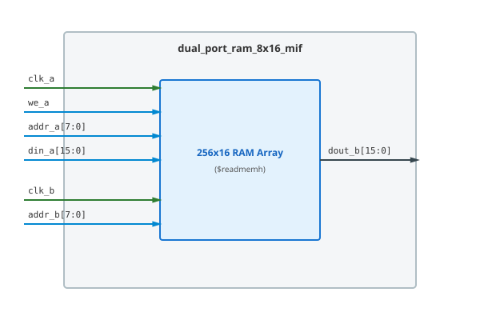

.. _datasheet_dual_port_ram_8x16_mif:

Dual-Port RAM 8x16 MIF Single Clock
----------------------------------------

Introduction
~~~~~~~~~~~~

This benchmark tests Block RAM (BRAM) primitive inferencing, memory initialization (`.mif` files), and basic dual-port memory functionality[cite: 3].
The module instantiates a single 256x16 dual-port RAM, with its own write clock (`clk_a`) and read clock (`clk_b`)[cite: 3].

Source codes
~~~~~~~~~~~~

See details in ``ram/dual_port_ram_8x16_mif``

Block Diagram
~~~~~~~~~~~~~

  Dual-Port RAM 8x16 MIF Single Clock schematic

Performance
~~~~~~~~~~~

Expect to consume 1 BRAM primitive (or equivalent LUT RAM logic)[cite: 3].

.. list-table:: Estimated Resource Utilization
  :header-rows: 1
  :class: longtable

  * - Benchmark
    - Inputs
    - Outputs
    - LUT5
    - FF
    - Carry
    - DSP
    - BRAM
  * - Single-Clock
    - 35
    - 16
    - 16
    - 16
    - 0
    - 0
    - 1
