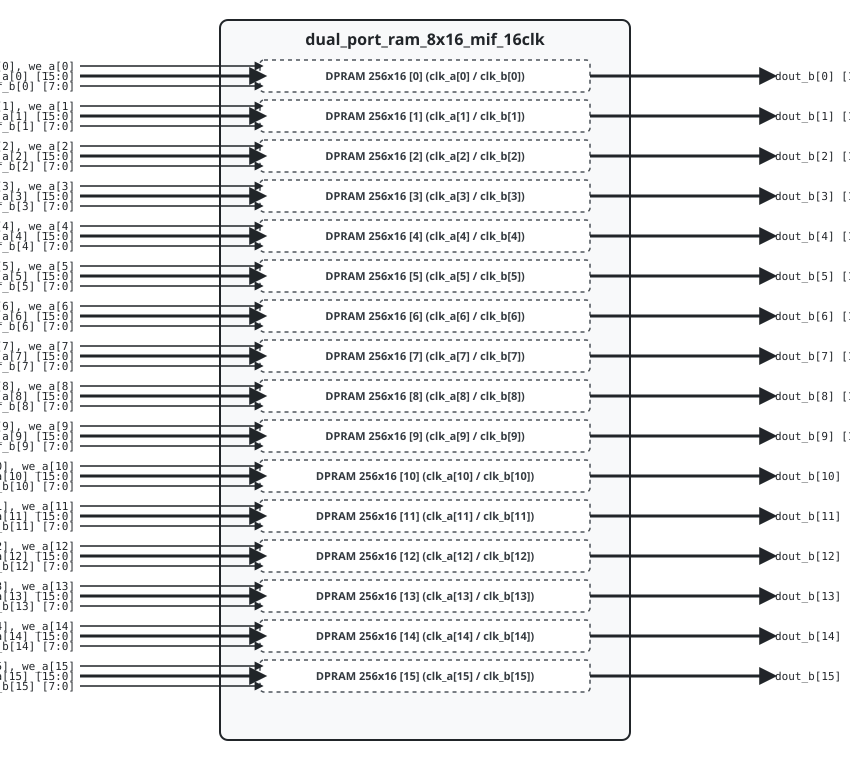

.. _datasheet_dual_port_ram_8x16_mif_16clk:

Dual-Port RAM 8x16 MIF 16 Clock
----------------------------------------

Introduction
~~~~~~~~~~~~

This benchmark tests Block RAM (BRAM) primitive inferencing, memory initialization (`.mif` files), and multi-clock routing scalability across **16 dual-port memory instances**.
The module instantiates 16 independent 256x16 dual-port RAMs, each with its own write clock (`clk_a`) and read clock (`clk_b`).

Source codes
~~~~~~~~~~~~

See details in ``ram/dual_port_ram_8x16_mif_16clk``

Block Diagram
~~~~~~~~~~~~~

  Dual-Port RAM 8x16 MIF 16 Clock schematic

Performance
~~~~~~~~~~~

Expect to consume 16 BRAM primitives (or equivalent LUT RAM logic).

.. list-table:: Estimated Resource Utilization
  :header-rows: 1
  :class: longtable

  * - Benchmark
    - Inputs
    - Outputs
    - LUT5
    - FF
    - Carry
    - DSP
    - BRAM
  * - 16-Clock
    - 544
    - 256
    - 256
    - 256
    - 0
    - 0
    - 16
