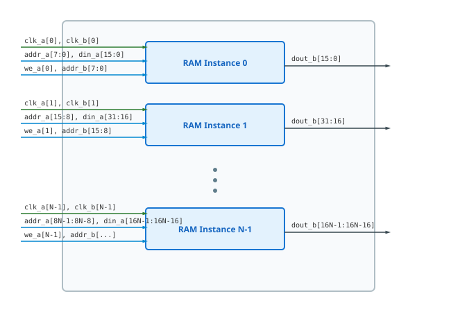

.. _datasheet_dual_port_ram_8x16_mif_4clk:

Dual-Port RAM 8x16 MIF 4 Clock
----------------------------------------

Introduction
~~~~~~~~~~~~

This benchmark tests Block RAM (BRAM) primitive inferencing, memory initialization (`.mif` files), and multi-clock routing scalability across **4 dual-port memory instances**.
The module instantiates 4 independent 256x16 dual-port RAMs, each with its own write clock (`clk_a`) and read clock (`clk_b`).

Source codes
~~~~~~~~~~~~

See details in ``ram/dual_port_ram_8x16_mif_4clk``

Block Diagram
~~~~~~~~~~~~~

This design is a 4-clock version of the illustrative schematic in :numref:`fig_dual_port_ram_8x16_mif_4clk`

.. _fig_dual_port_ram_8x16_mif_4clk:

  Dual-Port RAM 8x16 MIF 4 Clock schematic

Performance
~~~~~~~~~~~

Expect to consume 4 BRAM primitives (or equivalent LUT RAM logic).

.. list-table:: Estimated Resource Utilization
  :header-rows: 1
  :class: longtable

  * - Benchmark
    - Inputs
    - Outputs
    - LUT5
    - FF
    - Carry
    - DSP
    - BRAM
  * - 4-Clock
    - 136
    - 64
    - 64
    - 64
    - 0
    - 0
    - 4
