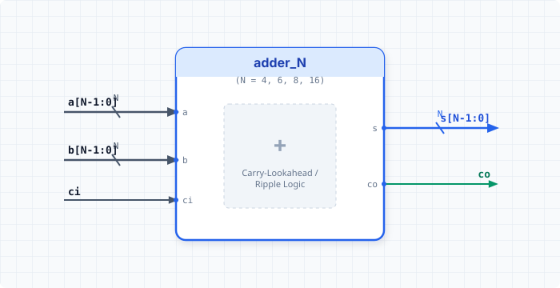

.. _datasheet_simple_gates_adders:

Adders (adder_N)
----------------

Introduction
~~~~~~~~~~~~

This benchmark suite is designed to test basic adder structures and carry logic across various bit-widths in FPGAs.
These modules implement 4-bit, 6-bit, 8-bit, and 16-bit adders, outputting the sum and carry-out for given multi-bit inputs and an input carry.

Source codes
~~~~~~~~~~~~

See details in 

- ``simple_gates/adder/adder_4``
- ``simple_gates/adder/adder_6``
- ``simple_gates/adder/adder_8``
- ``simple_gates/adder/adder_16``

Block Diagram
~~~~~~~~~~~~~

  Adder family schematic

Performance
~~~~~~~~~~~

Expect to consume minimal LUTs and carry chain resources depending on the bit-width.
These benchmarks reflect the speed and area efficiency of an FPGA's dedicated arithmetic carry logic as operand sizes scale.

.. warning:: The following resource utilization is just an estimation! Different tools in different versions may result differently.

.. list-table:: Estimated resource Utilization
  :header-rows: 1
  :class: longtable

  * - Benchmark
    - Inputs
    - Outputs
    - LUT4
    - FF
    - Carry
    - DSP
    - BRAM
  * - adder_4
    - 9
    - 5
    - 4
    - 0
    - 1
    - 0
    - 0
  * - adder_6
    - 13
    - 7
    - 6
    - 0
    - 1
    - 0
    - 0
  * - adder_8
    - 17
    - 9
    - 8
    - 0
    - 2
    - 0
    - 0
  * - adder_16
    - 33
    - 17
    - 16
    - 0
    - 4
    - 0
    - 0
