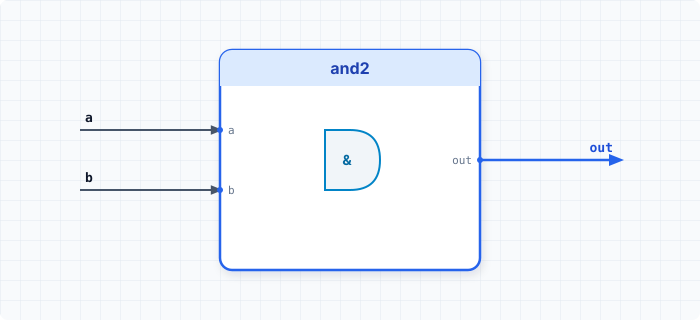

.. _datasheet_simple_gates_and2:

and2
----

Introduction
~~~~~~~~~~~~

This benchmark is designed to test basic 2-input AND gate logic and Look-Up Table (LUT) mapping in FPGAs.
It is a simple 2-input AND gate module, which outputs the logical AND result of two 1-bit inputs.

Source codes
~~~~~~~~~~~~

See details in ``simple_gates/and2``

Block Diagram
~~~~~~~~~~~~~

  and2 schematic

Performance
~~~~~~~~~~~

Expect to consume only 1 LUT and 0 flip-flops of an FPGA.
It can reflect the speed and area efficiency of basic 2-input primitive mapping in FPGA logic elements.

.. warning:: The following resource utilization is just an estimation! Different tools in different versions may result differently.

.. list-table:: Estimated resource Utilization
  :header-rows: 1
  :class: longtable

  * - Tool/Resource
    - Inputs
    - Outputs
    - LUT4
    - FF
    - Carry
    - DSP
    - BRAM
  * - General
    - 2
    - 1
    - 1
    - 0
    - 0
    - 0
    - 0
