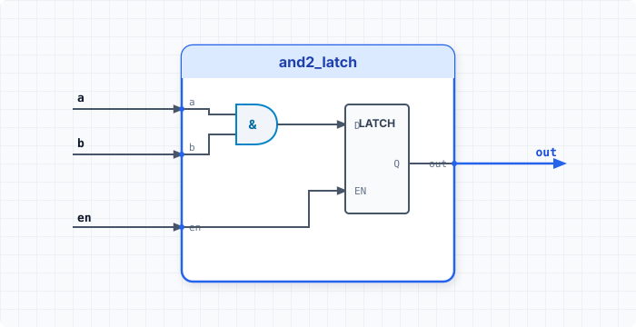

.. _datasheet_simple_gates_and2_latch:

and2_latch
----------

Introduction
~~~~~~~~~~~~

This benchmark is designed to test combination logic gated by an enable signal or latch primitive in FPGAs.
It is a 2-input AND gate combined with a latch structure, which outputs the logical AND result held according to the enable condition.

Source codes
~~~~~~~~~~~~

See details in ``simple_gates/and2_latch``

Block Diagram
~~~~~~~~~~~~~

  and2_latch schematic

Performance
~~~~~~~~~~~

Expect to consume minimal LUTs and latch/flip-flop resources of an FPGA.
It can reflect how synthesis tools map level-sensitive latching mechanisms combined with basic 2-input gate logic.

.. warning:: The following resource utilization is just an estimation! Different tools in different versions may result differently.

.. list-table:: Estimated resource Utilization
  :header-rows: 1
  :class: longtable

  * - Tool/Resource
    - Inputs
    - Outputs
    - LUT4
    - FF/Latch
    - Carry
    - DSP
    - BRAM
  * - General
    - 3
    - 1
    - 1
    - 1
    - 0
    - 0
    - 0
