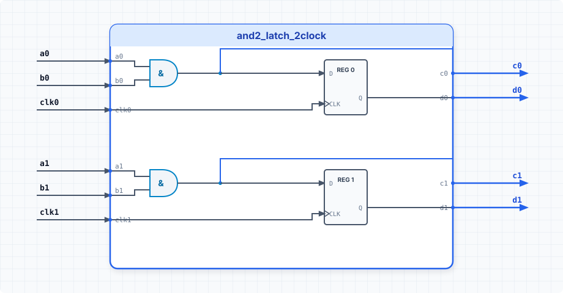

.. _datasheet_simple_gates_and2_latch_2clock:

and2_latch_2clock
-----------------

Introduction
~~~~~~~~~~~~

This benchmark is designed to test combination logic gated by dual clock signals or multi-clock latch mechanisms in FPGAs.
It features a 2-input AND gate combined with latch structures controlled across two separate clock domains.

Source codes
~~~~~~~~~~~~

See details in ``simple_gates/and2_latch_2clock``

Block Diagram
~~~~~~~~~~~~~

  and2_latch_2clock schematic

Performance
~~~~~~~~~~~

Expect to consume minimal LUTs and latch/flip-flop resources of an FPGA across multiple clock networks.
It reflects synthesis and place-and-route handling of multi-clock synchronization and level-sensitive latch primitive mapping.

.. warning:: The following resource utilization is just an estimation! Different tools in different versions may result differently.

.. list-table:: Estimated resource Utilization
  :header-rows: 1
  :class: longtable

  * - Tool/Resource
    - Inputs
    - Outputs
    - LUT4
    - FF/Latch
    - Carry
    - DSP
    - BRAM
  * - General
    - 4
    - 1
    - 1
    - 2
    - 0
    - 0
    - 0
