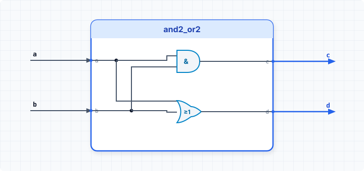

.. _datasheet_simple_gates_and2_or2:

and2_or2
--------

Introduction
~~~~~~~~~~~~

This benchmark is designed to test basic multi-level gate logic mapping (combinational AND and OR primitives) in FPGAs.
It evaluates how synthesis tools map connected two-input AND and OR logic gates into single or multiple Look-Up Tables (LUTs).

Source codes
~~~~~~~~~~~~

See details in ``simple_gates/and2_or2``

Block Diagram
~~~~~~~~~~~~~

  and2_or2 schematic

Performance
~~~~~~~~~~~

Expect to consume only 1 LUT and 0 flip-flops of an FPGA[cite: 1].
It reflects the efficiency of multi-gate LUT packing and basic combinational delay paths.

.. warning:: The following resource utilization is just an estimation! Different tools in different versions may result differently.

.. list-table:: Estimated resource Utilization
  :header-rows: 1
  :class: longtable

  * - Tool/Resource
    - Inputs
    - Outputs
    - LUT4
    - FF
    - Carry
    - DSP
    - BRAM
  * - General
    - 3
    - 1
    - 1
    - 0
    - 0
    - 0
    - 0
