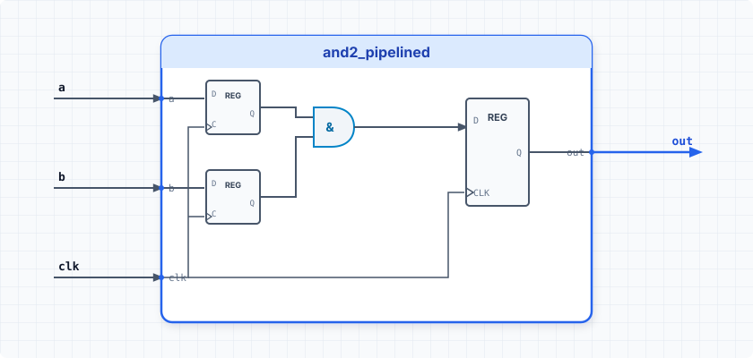

.. _datasheet_simple_gates_and2_pipelined:

and2_pipelined
--------------

Introduction
~~~~~~~~~~~~

This benchmark is designed to test pipelined combinational gate logic in FPGAs.
It features a 2-input AND gate followed by a register stage clocked on the positive edge of `clk`, providing a single-stage pipelined logic output.

Source codes
~~~~~~~~~~~~

See details in ``simple_gates/and2_pipelined``

Block Diagram
~~~~~~~~~~~~~

  and2_pipelined schematic

Performance
~~~~~~~~~~~

Expect to consume minimal LUT and flip-flop resources on an FPGA.
It evaluates how synthesis tools perform register retiming and LUT-FF packing for basic pipelined paths.

.. warning:: The following resource utilization is just an estimation! Different tools in different versions may result differently.

.. list-table:: Estimated resource Utilization
  :header-rows: 1
  :class: longtable

  * - Tool/Resource
    - Inputs
    - Outputs
    - LUT4
    - FF
    - Carry
    - DSP
    - BRAM
  * - General
    - 3
    - 1
    - 1
    - 1
    - 0
    - 0
    - 0
