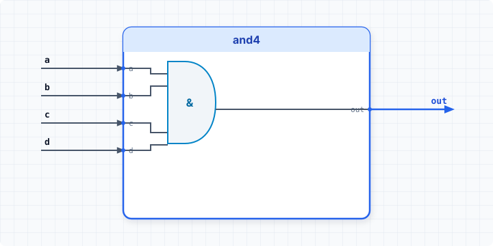

.. _datasheet_simple_gates_and4:

and4
----

Introduction
~~~~~~~~~~~~

This benchmark is designed to test wide combinational logic mapping (specifically a 4-input AND gate) in FPGAs.
It evaluates how synthesis tools map wide AND primitives into standard 4-input or 6-input Look-Up Tables (LUTs).

Source codes
~~~~~~~~~~~~

See details in ``simple_gates/and4``

Block Diagram
~~~~~~~~~~~~~

  and4 schematic

Performance
~~~~~~~~~~~

Expect to consume 1 LUT and 0 flip-flops of an FPGA.
It reflects the efficiency of mapping a single 4-input boolean product term into a single logic block without cascading delay.

.. warning:: The following resource utilization is just an estimation! Different tools in different versions may result differently.

.. list-table:: Estimated resource Utilization
  :header-rows: 1
  :class: longtable

  * - Tool/Resource
    - Inputs
    - Outputs
    - LUT4
    - FF
    - Carry
    - DSP
    - BRAM
  * - General
    - 4
    - 1
    - 1
    - 0
    - 0
    - 0
    - 0
