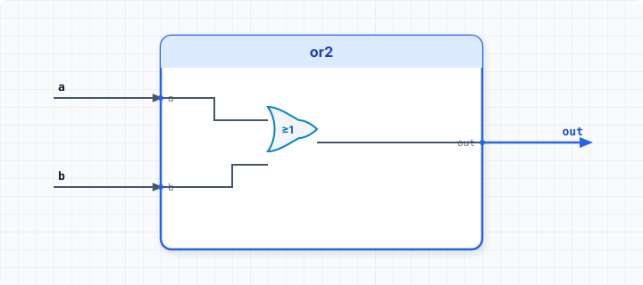

.. _datasheet_simple_gates_or2:

or2
---

Introduction
~~~~~~~~~~~~

This benchmark is designed to test basic 2-input logical OR gate primitives in FPGAs.
It computes the logical OR function (`a | b`) of two 1-bit inputs and outputs the combinational result.

Source codes
~~~~~~~~~~~~

See details in ``simple_gates/or2``

Block Diagram
~~~~~~~~~~~~~

  or2 schematic

Performance
~~~~~~~~~~~

Expect to consume 1 LUT and 0 flip-flops of an FPGA.
It evaluates how synthesis tools map basic 2-input boolean OR functions into standard Look-Up Table (LUT) resources.

.. warning:: The following resource utilization is just an estimation! Different tools in different versions may result differently.

.. list-table:: Estimated resource Utilization
  :header-rows: 1
  :class: longtable

  * - Tool/Resource
    - Inputs
    - Outputs
    - LUT4
    - FF
    - Carry
    - DSP
    - BRAM
  * - General
    - 2
    - 1
    - 1
    - 0
    - 0
    - 0
    - 0
