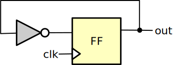

.. _datasheet_simple_registers_blinking:

Blinking
--------

Introduction
~~~~~~~~~~~~

This benchmark is designed to test the flip-flop/registers in FPGAs.
It is a 1-bit clock divider, which outputs half frequency of the input clock.

Source codes
~~~~~~~~~~~~

See details in ``simple_registers/blinking``

Block Diagram
~~~~~~~~~~~~~

  Blinking schematic

Performance
~~~~~~~~~~~

Expect to consume only 1 LUT and 1 flip-flop of an FPGA.
It can reflect the maximum speed of an FPGA between a LUT and a flip-flop.

.. list-table:: Estimated resource Utilization
  :widths: 20 15 15 15 15 15
  :header-rows: 1
  :class: longtable

  * - Tool/Resource
    - LUT4
    - FF
    - Carry
    - DSP
    - BRAM
  * - General
    - 1
    - 1
    - 0
    - 0
    - 0

