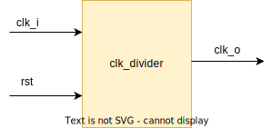

.. _datasheet_simple_registers_blinking:

Clock Divider
--------

Introduction
~~~~~~~~~~~~

This benchmark is designed to test the flip-flop/registers in FPGAs.
The benchmark takes an input clock signal clk_i and generates an output clock signal clk_o with one fourth the frequency of the input clock. The module also has a reset input rst to reset output signals.

Source codes
~~~~~~~~~~~~

See details in ``simple_registers/clk_divider``

Block Diagram
~~~~~~~~~~~~~

  Clock divider schematic

Performance
~~~~~~~~~~~

Expect to consume only 2 LUT and 2 flip-flop of an FPGA.
It can reflect the maximum speed of an FPGA between a LUT and a flip-flop.

.. warning:: The following resource utilization is just an estimation! Different tools in different versions may result differently.

.. list-table:: Estimated resource Utilization
  :header-rows: 1
  :class: longtable

  * - Tool/Resource
    - Inputs
    - Outputs
    - LUT5
    - FF
    - Carry
    - DSP
    - BRAM
  * - General
    - 0
    - 1
    - 2
    - 2
    - 0
    - 0
    - 0

