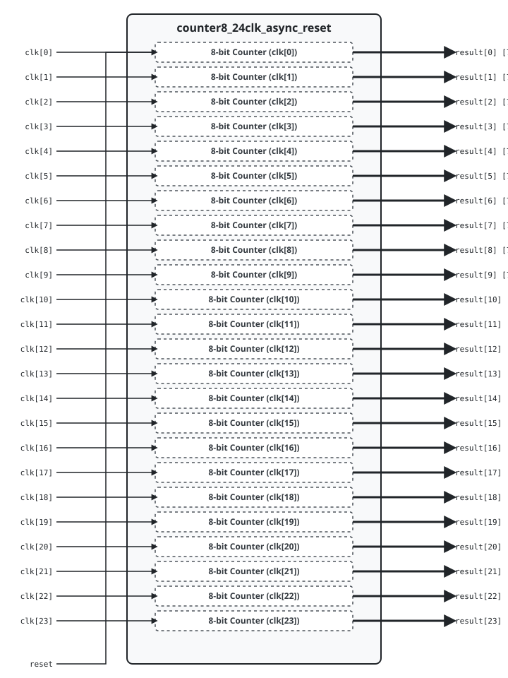

.. _datasheet_counter8_24clk_async_reset:

Counter 8-bit 24 Clock Asynchronous Reset
--------------------------------------------

Introduction
~~~~~~~~~~~~

This benchmark tests flip-flop/register networks and clock routing scalability across **24 independent clock domains** in FPGAs.

Source codes
~~~~~~~~~~~~

See details in ``counters/counter8_24clk_async_reset``

Block Diagram
~~~~~~~~~~~~~

  Counter 8-bit 24 Clock Asynchronous Reset schematic

Performance
~~~~~~~~~~~

Expect to consume 192 flip-flops and minimal LUT logic of an FPGA.

.. list-table:: Estimated Resource Utilization
  :header-rows: 1
  :class: longtable

  * - Benchmark
    - Inputs
    - Outputs
    - LUT5
    - FF
    - Carry
    - DSP
    - BRAM
  * - 24-Clock
    - 25
    - 192
    - 192
    - 192
    - 0
    - 0
    - 0
