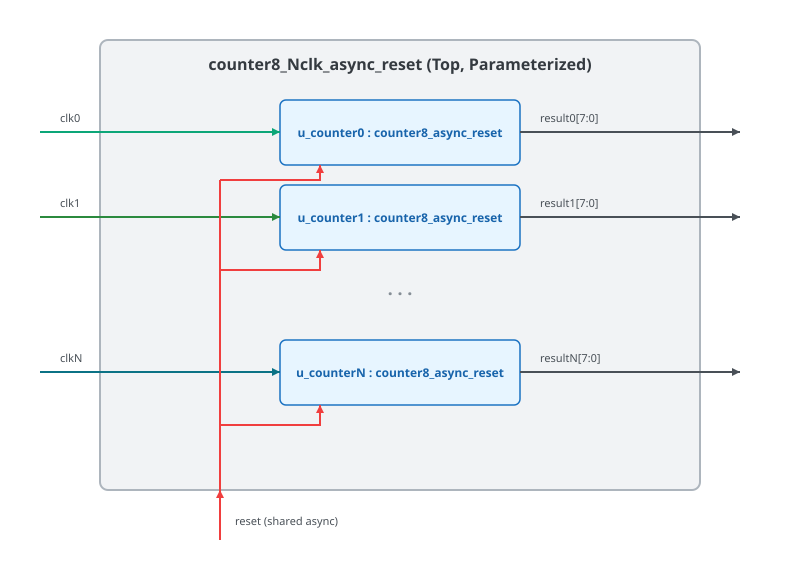

.. _datasheet_counter8_4clk_async_reset:

Counter 8-bit 4 Clock Asynchronous Reset
----------------------------------------

Introduction
~~~~~~~~~~~~

This benchmark is designed to test the flip-flop/registers across multiple clock domains in FPGAs.
This code generates four independent 8-bit counters, each operating on its own clock signal (`clk0`, `clk1`, `clk2`, and `clk3`). All four counters share a common active-high asynchronous reset input. When the reset signal is asserted high, all counter outputs are immediately cleared to 0 regardless of the clock transitions.

Source codes
~~~~~~~~~~~~

See details in ``counters/counter8_4clk_async_reset``

Block Diagram
~~~~~~~~~~~~~

This design is a 4-clock version of the illustrative schematic in :numref:`fig_counter8_4clk_async_reset`

.. _fig_counter8_4clk_async_reset:

  Counter 8-bit 4 Clock Asynchronous Reset schematic

Performance
~~~~~~~~~~~

Expect to consume only 32 flip-flops and minimal LUT logic of an FPGA.
It can evaluate the routability and performance of multi-clock networks and flip-flop asynchronous reset trees.

.. warning:: The following resource utilization is just an estimation! Different tools in different versions may result differently.

.. list-table:: Estimated resource Utilization
  :header-rows: 1
  :class: longtable

  * - Tool/Resource
    - Inputs
    - Outputs
    - LUT5
    - FF
    - Carry
    - DSP
    - BRAM
  * - General
    - 5
    - 32
    - 32
    - 32
    - 0
    - 0
    - 0
