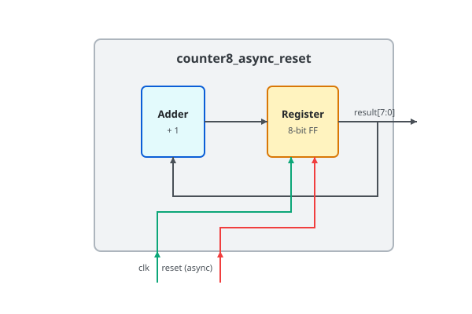

.. _datasheet_counter8_async_reset:

Counter 8-bit Asynchronous Reset
--------------------------------

Introduction
~~~~~~~~~~~~

This benchmark is designed to test flip-flops and registers with an asynchronous reset in FPGAs.
It generates an 8-bit counter operating on a single clock signal (``clk``)[cite: 4].
The counter includes an active-high asynchronous reset input (``reset``)[cite: 4].
When the reset signal is asserted high, the counter output is immediately cleared to 0 regardless of clock transitions[cite: 4].

Source codes
~~~~~~~~~~~~

See details in ``counters/counter8_async_reset``

Block Diagram
~~~~~~~~~~~~~

  Counter 8-bit Asynchronous Reset schematic

Performance
~~~~~~~~~~~

Expect to consume only 8 flip-flops and minimal LUT logic of an FPGA.
It can evaluate the routability and performance of single-clock networks and flip-flop asynchronous reset trees.

.. warning:: The following resource utilization is just an estimation! Different tools in different versions may result differently.

.. list-table:: Estimated resource Utilization
  :header-rows: 1
  :class: longtable

  * - Tool/Resource
    - Inputs
    - Outputs
    - LUT5
    - FF
    - Carry
    - DSP
    - BRAM
  * - General
    - 2
    - 8
    - 8
    - 8
    - 0
    - 0
    - 0
