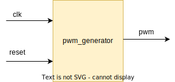

.. _datasheet_simple_registers_blinking:

PWM Generaotr
--------

Introduction
~~~~~~~~~~~~

This benchmark is designed to test the flip-flop/registers in FPGAs.
This code generates a PWM signal using a clock divider to control the frequency of the PWM. The clock divider is implemented using a counter that counts up to the value of the DIVISORparameter and resets to 0. The PWM signal is generated using another counter that counts up tothe PERIOD and DUTY_CYCLE parameters and sets the pwm output signal accordingly.

Source codes
~~~~~~~~~~~~

See details in ``simple_registers/pwm_generator``

Block Diagram
~~~~~~~~~~~~~

  PWM Generator schematic

Performance
~~~~~~~~~~~

Expect to consume only 50 LUT and 33 flip-flop of an FPGA.
It can reflect the maximum speed of an FPGA between a LUT and a flip-flop.

.. warning:: The following resource utilization is just an estimation! Different tools in different versions may result differently.

.. list-table:: Estimated resource Utilization
  :header-rows: 1
  :class: longtable

  * - Tool/Resource
    - Inputs
    - Outputs
    - LUT5
    - FF
    - Carry
    - DSP
    - BRAM
  * - General
    - 0
    - 1
    - 50
    - 33
    - 0
    - 0
    - 0

