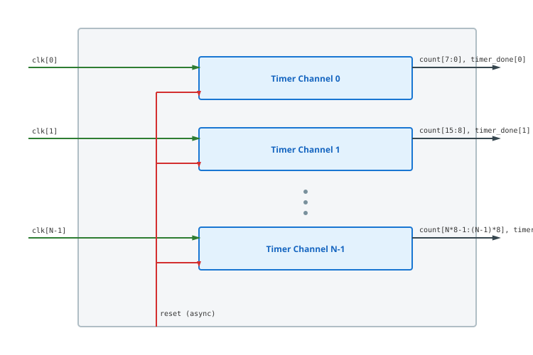

.. _datasheet_timer8_32clk_async_reset:

Timer 8-bit 32 Clock Asynchronous Reset
------------------------------------------

Introduction
~~~~~~~~~~~~

This benchmark tests flip-flop/register networks and clock routing scalability across **32 independent clock domains** in FPGAs.
The design generates 32 independent 8-bit countdown timers with configurable load periods, enable signals, and timer complete flags.

Source codes
~~~~~~~~~~~~

See details in ``timers/timer8_32clk_async_reset``

Block Diagram
~~~~~~~~~~~~~

This design is a 32-clock version of the illustrative schematic in :numref:`fig_timer8_32clk_async_reset`

.. _fig_timer8_32clk_async_reset:

  Timer 8-bit 32 Clock Asynchronous Reset schematic

Performance
~~~~~~~~~~~

Expect to consume 288 flip-flops and minimal LUT logic of an FPGA.

.. list-table:: Estimated Resource Utilization
  :header-rows: 1
  :class: longtable

  * - Benchmark
    - Inputs
    - Outputs
    - LUT5
    - FF
    - Carry
    - DSP
    - BRAM
  * - 32-Clock
    - 289
    - 288
    - 512
    - 288
    - 0
    - 0
    - 0
