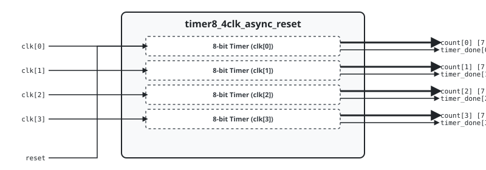

.. _datasheet_timer8_4clk_async_reset:

Timer 8-bit 4 Clock Asynchronous Reset
------------------------------------------

Introduction
~~~~~~~~~~~~

This benchmark tests flip-flop/register networks and clock routing scalability across **4 independent clock domains** in FPGAs.
The design generates 4 independent 8-bit countdown timers with configurable load periods, enable signals, and timer complete flags.

Source codes
~~~~~~~~~~~~

See details in ``timers/timer8_4clk_async_reset``

Block Diagram
~~~~~~~~~~~~~

  Timer 8-bit 4 Clock Asynchronous Reset schematic

Performance
~~~~~~~~~~~

Expect to consume 36 flip-flops and minimal LUT logic of an FPGA.

.. list-table:: Estimated Resource Utilization
  :header-rows: 1
  :class: longtable

  * - Benchmark
    - Inputs
    - Outputs
    - LUT5
    - FF
    - Carry
    - DSP
    - BRAM
  * - 4-Clock
    - 37
    - 36
    - 64
    - 36
    - 0
    - 0
    - 0
