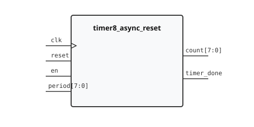

.. _datasheet_timer8_async_reset:

Timer 8-bit Asynchronous Reset
------------------------------

Introduction
~~~~~~~~~~~~

This benchmark is designed to test flip-flops, registers, and control logic with an asynchronous reset in FPGAs[cite: 1, 2].
It generates an 8-bit countdown timer operating on a single clock signal (``clk``)[cite: 1].
The timer includes an active-high asynchronous reset input (``reset``), an active-high enable input (``en``), and a programmable 8-bit reload period input (``period``)[cite: 1].
When the reset signal is asserted high, the counter output and completion flag are immediately cleared to 0 regardless of clock transitions[cite: 1].

Source codes
~~~~~~~~~~~~

See details in ``counters/timer8_async_reset``

Block Diagram
~~~~~~~~~~~~~

  Timer 8-bit Asynchronous Reset schematic

Performance
~~~~~~~~~~~

Expect to consume approximately 9 flip-flops and modest LUT logic of an FPGA to support the countdown and reload logic.
It can evaluate the routability and performance of single-clock networks, datapath comparison, and flip-flop asynchronous reset trees.

.. warning:: The following resource utilization is just an estimation! Different tools in different versions may result differently.

.. list-table:: Estimated resource Utilization
  :header-rows: 1
  :class: longtable

  * - Tool/Resource
    - Inputs
    - Outputs
    - LUT5
    - FF
    - Carry
    - DSP
    - BRAM
  * - General
    - 11
    - 9
    - 12
    - 9
    - 0
    - 0
    - 0
